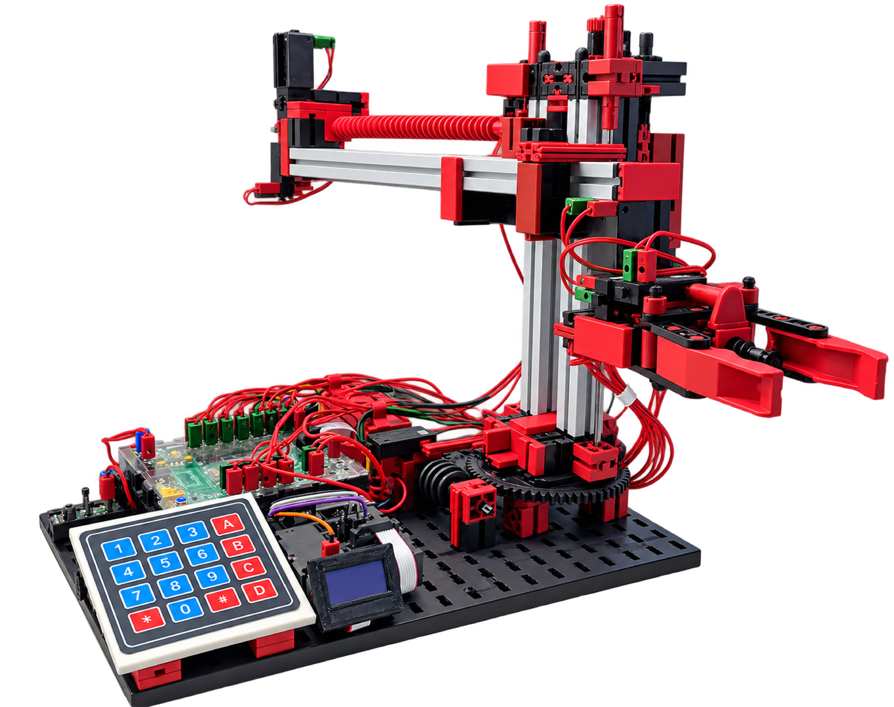

# fischertechnik 3-Achs-Roboter mit ftDuino
Programme, Dokumentationen und weitere Unterlagen zu meinemfischertechnik 3-Achs-Roboter mit ftDuino-Steuerung.

## Projektbeschreibung
Die hier vorgestellte Variante des fischertechnik 3-Achs-Roboters wird mit einem **ftDuino-Controller** gesteuert. An dessen I²C-Port werden eine **4×4-Matrixtastatur** und ein **0,96"-OLED-Display** betrieben.

Diese Steuerung bietet dem Modell folgende Eigenschaften:

* kostengünstige Steuerungshardware
* Programmierung auf Basis von C++ bzw. C
* Display direkt am Modell
  * menügeführte Bedienung
  * Statusanzeige
* vom Computer unabhängiger Betrieb
* geeignet für Vorführungen und Ausstellungen

## Hardware
Der mechanische Aufbau und die grundlegende Verdrahtung des 3-Achs-Roboters erfolgen entsprechend der fischertechnik Bauanleitung „ROBO TX Automation Robots“.

Die im Video verwendete
[Hardware-Erweiterung](https://github.com/HR-Projekte/ft-Hochregallager-und-ft-3-Achs-Roboter/blob/main/Bilder/I2C-Konfiguration.jpg?raw=true) und Schaltplan.  
Optionale Ergänzung:
[Hardware Option](Bilder/Hardware-option.jpg)  
und die stl-Datei für das
[Keypad_70x78](https://raw.githubusercontent.com/HR-Projekte/ft-Hochregallager-und-ft-3-Achs-Roboter/main/3D-Druck/Keypad_70x78.stl) zum Download.

Eine preislich günstigere 
[I2C-Alternative](https://github.com/HR-Projekte/ft-Hochregallager-und-ft-3-Achs-Roboter/blob/main/Bilder/I2C-alternativ.jpg)

## Stücklisten
Bauteile für den 3-Achs-Roboter ohne Steuerung:
[Einzelteile-Grundmaschine](Stücklisten/Einzelteile-Grundmaschine.pdf)  
Bauteile für die Steuerung
[Einzelteile-Steuerung](https://github.com/HR-Projekte/ft-Hochregallager-und-ft-3-Achs-Roboter/blob/main/Stücklisten/Einzelteile-Steuerung.pdf)

## Software
Das Steuerungsprogramm für das Hochregallager ist als Arduino-Sketch abgelegt.  
[3-Achs-Roboter](Programme/)

#### Weiterentwicklung

Rückblickend wäre es insbesondere im Hinblick auf die Übersichtlichkeit sinnvoll gewesen, das Hauptprogramm `ft_3_Achs_Robot.ino` stärker modular aufzubauen. Während der Entwicklungsphase hat es sich jedoch als vorteilhaft erwiesen, die Funktionen zunächst gemeinsam in einer Datei zu entwickeln.

Ein möglicher nächster Schritt wäre die Auslagerung der Displaysteuerung in eigene Dateien, beispielsweise:

`DisplayAnzeige.cpp`
`DisplayAnzeige.h`

Nach diesem Prinzip könnten anschließend weitere Funktionsbereiche des Programms schrittweise modularisiert werden.

## Dokumentation
Ein Flussdiagramm zur 
[Menüstruktur](https://github.com/HR-Projekte/ft-Hochregallager-und-ft-3-Achs-Roboter/blob/main/Dokumentation/Menue-Ablauf.pdf)

## Video

Eine Vorstellung des Hochregallagers und seiner Steuerung ist auf YouTube zu sehen:  
[Video zum fischertechnik Hochregallager mit ftDuino](https://www.youtube.com/watch?v=UzXN1IyupY0)

